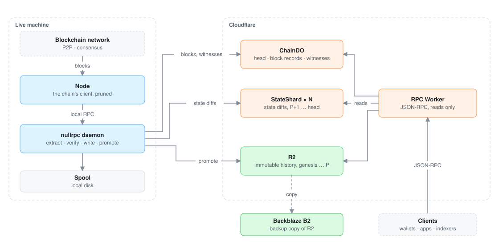
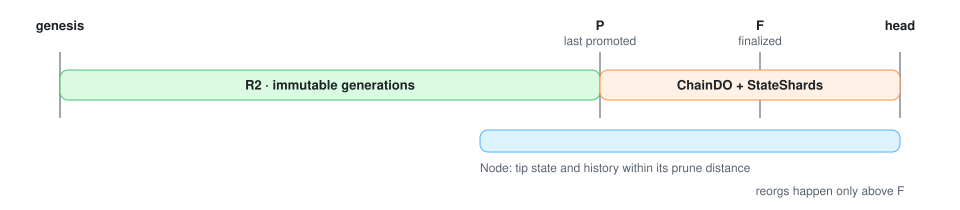

# nullrpc

nullrpc serves a blockchain's JSON-RPC from Cloudflare's network. A pruned node follows the
blockchain and executes its blocks. Everything the RPC needs is copied out of the node: the full
history goes to R2 as an immutable archive, and the newest blocks go to Durable Objects. A
Worker answers requests from those two stores and never calls a node.

nullrpc serves one blockchain: one node, one daemon, one archive. The blockchain must be
EVM-compatible and its client must serve the standard `eth_` and `debug_` RPC.

**Benchmark.** Ethereum mainnet is the reference blockchain. Every size, rate and parameter value
in these docs is Ethereum mainnet's, and every benchmark runs on it.



## Where each block lives



| Store | Blocks | Written by |
|---|---|---|
| R2 | genesis to `P`, immutable | the backfill, then the daemon's promotions |
| `ChainDO` and `StateShard`s | `P+1` to head | the daemon, every block |
| Node | tip state and recent history | the blockchain |

`P <= F <= head` at all times. Promotion moves `P` up toward `F` about once an hour.

## Read in this order

| Doc | What it covers |
|---|---|
| [pipeline.md](pipeline.md) | How data gets from a node into R2 and the Durable Objects: backfill, prune, live |
| [dags.md](dags.md) | Every pipeline as a dependency graph: steps, inputs, outputs, retries |
| [storage.md](storage.md) | The storage specification: R2 objects and encodings, Durable Object schemas, promotion, reorgs |
| [infrastructure.md](infrastructure.md) | Object store, backfill machines, live machines, access |

## Terms

| Term | Meaning |
|---|---|
| `B` | The last block of the backfill. The archive starts at genesis and ends at `B`. |
| `P` | The last promoted block. R2 holds genesis to `P`. |
| `F` | The blockchain's finalized block. Blocks at or below `F` never reorg. |
| head | The newest block the node has executed. |
| live window | Blocks `P+1` to head, held in the Durable Objects. |
| generation | One immutable version of the archive, named by a manifest. `HEAD.json` points at the current one. |
| promotion | Moving finalized blocks from the live window into a new R2 generation. |
| witness | A block's pre-state: the value before the block of every account, slot and code it touches. |
| spool | The daemon's directory on local disk that holds each block until it is in R2. |

## Diagrams

Every diagram is an SVG in [diagrams/](diagrams/), generated by
[diagrams/diagrams.py](diagrams/diagrams.py). Edit the script and run it; do not edit the SVGs
by hand. Colors: blue runs on our machines, orange is Cloudflare compute, green is storage,
grey is outside nullrpc, red stops the pipeline.

```bash
python3 docs/diagrams/diagrams.py
```
