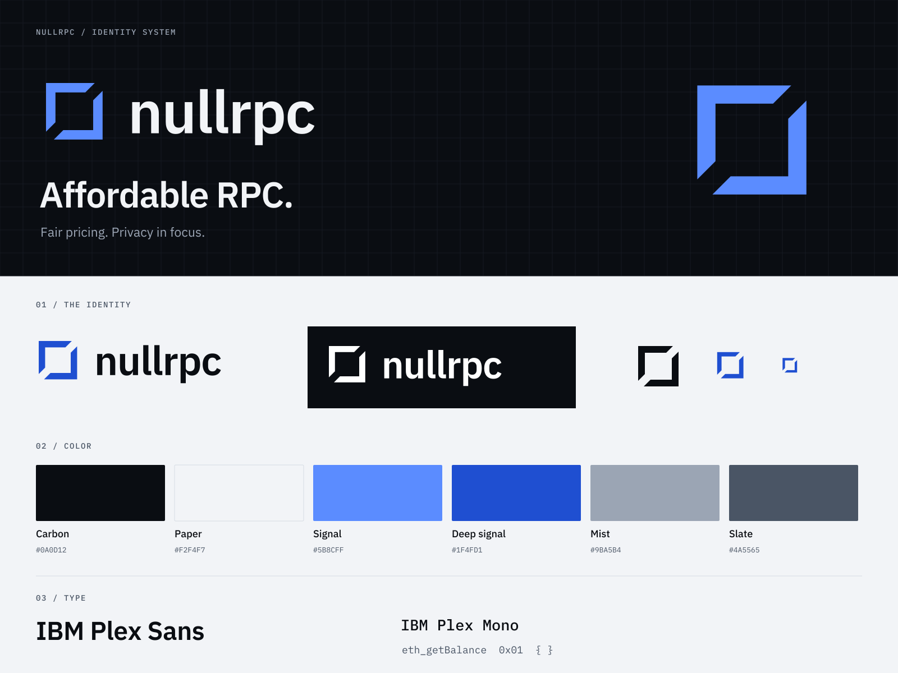
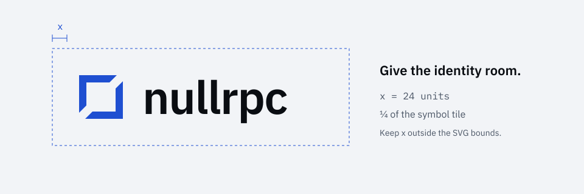

# nullrpc brand kit

**Affordable RPC.** The primary headline says exactly what nullrpc offers. Its supporting line is **“Fair pricing. Privacy in focus.”** The brand covers RPC across networks as the service grows; it is not defined by Ethereum or archive access alone.

The identity presents nullrpc as infrastructure: precise geometry, a sober carbon-and-cobalt palette, IBM Plex type, tight corners and hairline structure. The symbol is **the seal**, a square enclosure cut along its diagonal into two interlocking halves around an empty centre. It reads as the null set drawn as a sealed boundary: two halves for request and response, and the cut for the line where every response is checked.

Use the broad RPC promise in brand-level copy. Put available networks, supported methods and archive capabilities in product details, and distinguish planned networks from live support. A separate motto is not required.



## Start here

- Open [the visual guide](index.html) in a browser. It works offline, with bundled fonts and local assets.
- Read [positioning and voice](voice.md), [color and contrast](color.md), and [typography and layout](typography.md).
- Use the SVG masters in [assets/](assets/) for design work. Lettering is outlined, so no font installation is needed to display the logos.
- Use [CSS tokens](tokens/brand.css) or [JSON tokens](tokens/brand.json) in an interface. Fonts and licenses are in [fonts/](fonts/README.md).
- See [review notes](review.md) for the checks performed on this kit.

The applications in [`apps/`](../../apps/) (`landing`, `app`, `dashboard`) apply this identity from local copies of the assets and fonts. When the kit changes, update those copies too.

## Identity rules

### The seal

The symbol is drawn on a **96 × 96 unit tile**. The enclosure's outer edge runs from 12 to 84 on both axes with a **12-unit stroke**, so it leaves a 12-unit margin inside the tile. The square is cut along the null diagonal `x + y = 96` into two L-shaped halves: one holds the top and left sides, the other the bottom and right. Each half ends in a 45° cut. The cuts lie on the parallel lines `x + y = 86` and `x + y = 106`, so the halves face each other across a gap about 14 units wide, at the top-right and bottom-left corners. The centre stays empty.

At **16–23 CSS px** the regular symbol's cuts and stroke fall between pixels. [mark-small.svg](assets/mark-small.svg) is an optical master on a 16-unit grid with a whole-pixel **2-unit stroke**. Use it at those sizes and only there.

The wordmark is lowercase **nullrpc** in IBM Plex Sans SemiBold, outlined, with **−1.5 unit tracking at 76 units** (about −0.02em). In the 440 × 112 lockup the seal tile sits at (8, 8) and the wordmark starts at x = 124. Use the supplied artwork rather than retyping or redrawing it.

| Asset | Use | Background |
|---|---|---|
| [logo-dark.svg](assets/logo-dark.svg) · [PNG](assets/logo-dark.png) | Default horizontal logo: Signal symbol, Paper lettering | Carbon or a similarly dark solid field |
| [logo-light.svg](assets/logo-light.svg) · [PNG](assets/logo-light.png) | Deep signal symbol, Carbon lettering | Paper or white |
| [logo-mono-dark.svg](assets/logo-mono-dark.svg) · [PNG](assets/logo-mono-dark.png) | One-color Carbon artwork | Light field; single-ink printing |
| [logo-mono-light.svg](assets/logo-mono-light.svg) · [PNG](assets/logo-mono-light.png) | One-color white artwork | Dark field |
| [wordmark-dark.svg](assets/wordmark-dark.svg) / [wordmark-light.svg](assets/wordmark-light.svg) | Text-only lockup when the symbol is already nearby | Dark / light, respectively |
| [mark-signal.svg](assets/mark-signal.svg) / [mark-deep.svg](assets/mark-deep.svg) | Standalone colored symbol | Dark / light, respectively |
| [mark-dark.svg](assets/mark-dark.svg) / [mark-light.svg](assets/mark-light.svg) | One-color symbol (Carbon / white ink) | Light / dark, respectively |
| [mark-small.svg](assets/mark-small.svg) | Optical small symbol at 16–23 CSS px, Signal ink | Dark field |

Naming convention: `logo-dark` and `wordmark-dark` describe the **background**. `mono-dark` and `mark-dark` describe the **ink**. Choose by the table above; transparent logos do not include a background.

### Space and size



- Keep **x = ¼ of the symbol tile** clear outside all four SVG bounds. At the master logo size of 440 × 112, x is 24 units. Scale the spacing with the artwork.
- The horizontal lockup is **440:112**. Set its width and let the height scale.
- Minimum horizontal logo width: **144 CSS px** on screen, **38 mm** in print. Use the symbol below that size.
- Minimum wordmark width: **112 CSS px**. Use the regular symbol at **24 CSS px or larger**; use the optical small symbol at **16–23 CSS px**. Do not render the symbol smaller than 16 px.
- The avatar places the symbol at 3× scale in the centre of a 512 px Carbon square, which keeps it inside a circular crop. Do not enlarge it to the edges.

These are production guidelines, not assertions that every printing process can reproduce the minimum. Proof the actual medium.

### Keep the identity intact

Preserve the geometry, the diagonal cut, the empty centre, the wordmark spacing and the color pairings. Do not stretch, rotate, outline or round the symbol. Do not close the gap, fill the centre, change the cut's angle, or set the two halves in different colors. No glow, gradient or drop shadow on the logo or anywhere near it. Avoid busy photographs behind the logo; use a solid field with clear space. The symbol can be a large decorative motif, but the intact primary logo must stay readable somewhere in the composition.

Use the symbol alone for a favicon or an avatar with adjacent account naming. In unfamiliar contexts, use the full lockup. Give informative logos `alt="nullrpc"`; use empty alt text for a decorative repeated mark. Avoid redundant screen-reader names when a logo and adjacent text are in the same link.

## Ready-to-use applications

| Asset | Dimensions | Use |
|---|---|---|
| [Social card SVG](assets/social-card.svg) · [PNG](assets/social-card.png) | 1200 × 630 | Open Graph/link preview; dark grid field, headline, two values |
| [Documentation banner SVG](assets/banner.svg) · [PNG](assets/banner.png) | 1600 × 480 | Repository/docs cover on Paper; scale proportionally |
| [Avatar SVG](assets/avatar.svg) · [512 PNG](assets/avatar-512.png) · [1024 PNG](assets/avatar-1024.png) | Square | Organization/project avatar; safe for circular masks |
| [Favicon SVG](assets/favicon.svg) · [ICO](assets/favicon.ico) | SVG 32 × 32; ICO 16/32/48 | Browser tab icon: optical seal on a Carbon tile with 4 px corners |
| [16 PNG](assets/favicon-16.png) · [32 PNG](assets/favicon-32.png) · [48 PNG](assets/favicon-48.png) | Named sizes | Legacy icon consumers |
| [Apple touch icon](assets/apple-touch-icon.png) | 180 × 180 | Home-screen bookmark |
| [Grid pattern](assets/pattern.svg) | 1600 × 480 | Engineering grid (40-unit cells) with a faint seal as a registration mark; decoration only, not a data chart |
| [Brand overview SVG](assets/brand-board.svg) · [PNG](assets/brand-board.png) | 1600 × 1200 | Quick reference and stakeholder handoff |

All SVG graphics are editable paths, use sRGB hex colors, and include an accessible title and description. PNG logos preserve transparency; social cards, banners and avatars have opaque backgrounds. The [asset manifest](assets/manifest.json) records dimensions and alpha channels. The favicon ICO contains the three listed bitmap sizes.

The social card leads with the two customer values. Keep implementation details in technical documentation, and keep specific prices, network coverage, service guarantees and privacy policies current wherever those details are published.

## Integrating the tokens

Copy the `assets`, `fonts` and `tokens` directories together to preserve relative font URLs. Load `tokens/brand.css`, then choose a theme on the region you want to style:

```html
<link rel="stylesheet" href="/brand/tokens/brand.css">
<section class="nullrpc-brand" data-nullrpc-theme="dark">
  
  <h1>Affordable RPC.</h1>
</section>
```

```css
.rpc-panel {
  padding: var(--nr-space-5);
  background: var(--nr-surface);
  color: var(--nr-text);
  border: 1px solid var(--nr-border);
  border-radius: var(--nr-radius-md);
}
.rpc-action {
  background: var(--nr-button-bg);
  color: var(--nr-button-text);
  min-height: 44px;
  padding: 12px 20px;
  border: 0;
  border-radius: var(--nr-radius-md);
  font: 500 0.9375rem/1.25 var(--nr-font-sans);
}
.rpc-action:focus-visible {
  outline: 2px solid var(--nr-focus);
  outline-offset: 3px;
}
```

In dark mode the button is Cobalt with white text, while links, marks and focus use the lighter Signal. Keep the two apart: Signal is too light to carry white text, and Cobalt is too dark to read as text on Carbon. Keep a focus ring separated from the button by the background-colored gap. Use `--nr-border-strong` for controls that rely on a boundary to be identified; `--nr-border` is only a decorative hairline. The CSS is scoped and does not reset the host application's elements.

## Rebuilding and verification

The kit has no runtime dependencies. Its scripts need:

- Python 3 with [`fonttools`](https://pypi.org/project/fonttools/) for `build-assets.py` (reads the bundled `.woff` fonts);
- Node.js with [`sharp`](https://www.npmjs.com/package/sharp) for `render-assets.cjs` (PNG exports and `assets/manifest.json`);
- Node.js with [`playwright`](https://www.npmjs.com/package/playwright) and Chromium for `check-guide.cjs`. Set `BRAND_BROWSER_PATH` to use an existing Chromium binary;
- [ImageMagick](https://imagemagick.org/) 7 for the multi-resolution ICO.

`check-contrast.py` needs only the Python standard library. Font sources are bundled, and the scripts make no network calls. Run from the repository root:

```sh
python3 docs/brand/scripts/build-assets.py
node docs/brand/scripts/render-assets.cjs
magick docs/brand/assets/favicon-16.png docs/brand/assets/favicon-32.png \
  docs/brand/assets/favicon-48.png docs/brand/assets/favicon.ico
python3 docs/brand/scripts/check-contrast.py
node docs/brand/scripts/check-guide.cjs
```

`check-guide.cjs` writes its screenshots and `browser-review.json` to `docs/brand/previews/`. That folder is review output: inspect it, then delete it or leave it out of commits.

Change the source geometry, palette or exact copy in `build-assets.py`, then regenerate; do not patch an individual SVG or PNG. Adjust semantic colors in both token files and rerun the contrast check.

## Credits

The vector system was constructed for this repository. Lettering is outlined from [IBM Plex](https://github.com/IBM/plex) Sans SemiBold; IBM Plex Sans and IBM Plex Mono are used under the SIL Open Font License, and their license notices are bundled unchanged. See [font provenance](fonts/README.md). The palette and geometry in `scripts/build-assets.py` and `tokens/` are the source of truth for the identity.
