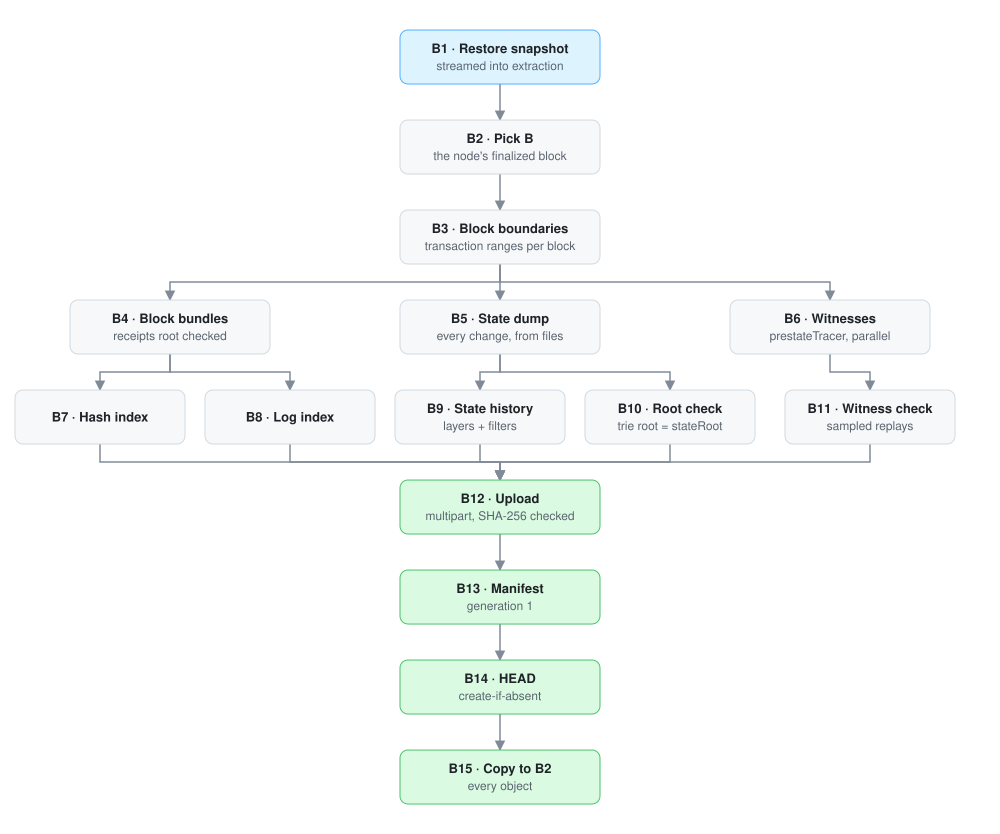
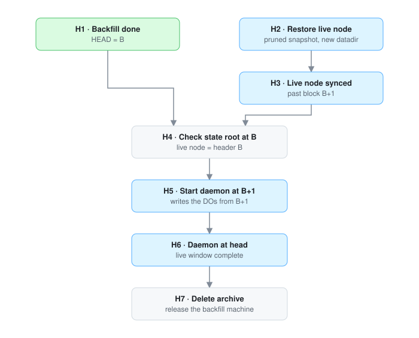
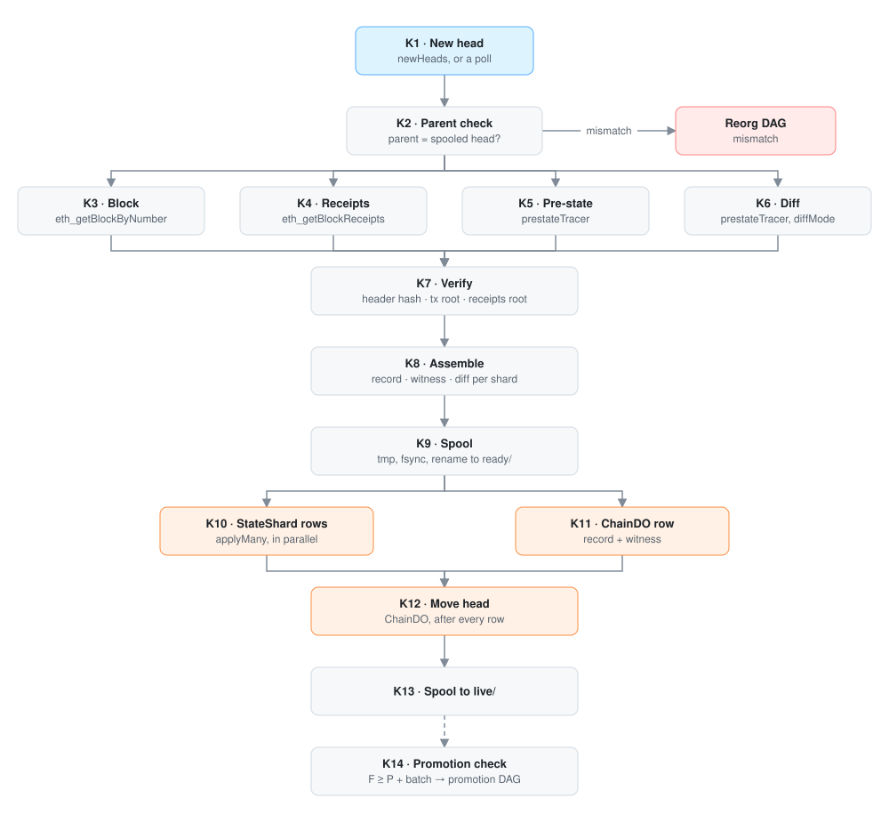
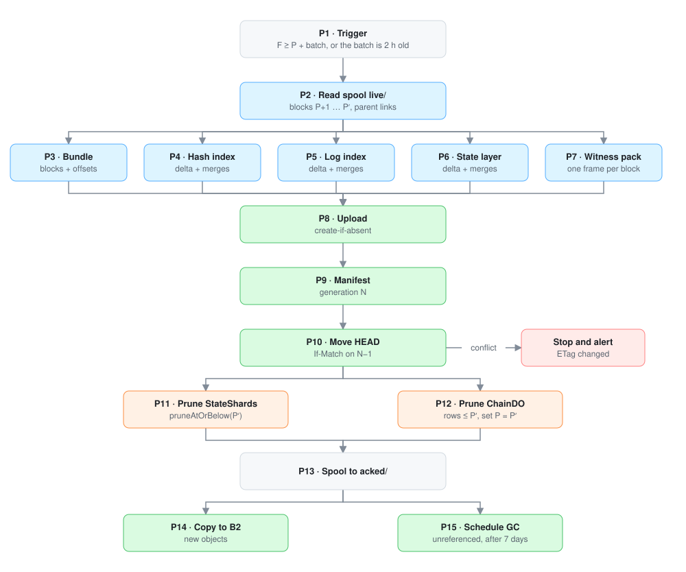
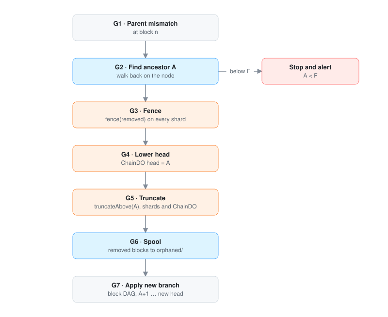

# DAGs

Every nullrpc pipeline as a directed acyclic graph of steps. [pipeline.md](pipeline.md)
explains why each step exists. This document is the reference for what each step reads,
writes and needs before it can run.

| DAG | Runs | Where |
|---|---|---|
| [Backfill](#backfill) | once, and on format changes | backfill machine |
| [Handoff](#handoff) | once, after the backfill | live machine |
| [Block](#block) | for every new block | daemon |
| [Promotion](#promotion) | about once an hour | daemon |
| [Reorg](#reorg) | when a new block's parent is not the spooled head | daemon |
| [Restart](#restart) | every time the daemon starts | daemon |

## Rules for every step

- **Idempotent.** A step can run again with the same input and produce the same output. R2
  objects are content-addressed and written create-if-absent; Durable Object writes replace
  rows with identical content; spool moves are renames.
- **Recorded.** A step that finishes records it (in the work directory for the backfill, by the
  spool directory a file is in for the daemon). A restart skips finished steps.
- **Retried with backoff** on network and service errors: 1 s, doubling, capped at 5 minutes,
  forever. The daemon keeps spooling new blocks while a write to Cloudflare is retried.
- **Stopped on a check failure.** A failed hash, root or parent check is never retried. The
  pipeline stops and alerts. Retrying cannot fix wrong data.
- **One at a time** for the block, promotion and reorg DAGs. A promotion runs while
  new blocks are being written, but never two promotions, and never a promotion during a
  reorg.

## Backfill

| Step | Needs | Reads | Writes | Fails when |
|---|---|---|---|---|
| B1 Restore snapshot | | the network's archive snapshot | the node's datadir | download or extraction error (retry) |
| B2 Pick B | B1 | the node: `finalized` | `B` in the work directory | |
| B3 Block boundaries | B2 | client files | transaction range per block | a block's range is missing or overlaps |
| B4 Block bundles | B3 | client files, node RPC for anything the files lack | `segments/` | a receipts root, header hash or transaction hash mismatch |
| B5 State dump | B3 | client history files | sorted change streams | a change outside its block's range |
| B6 Witnesses | B3 | node database: each block executed in process | one witness per block | the gas used or receipts root differs from the header, then stop |
| B7 Hash index | B4 | block bundles | `hash-index/` | |
| B8 Log index | B4 | block bundles | `log-index/` | |
| B9 State history | B5 | change streams | `state/v1/layers/`, filters | |
| B10 Root check | B5 | change streams | nothing kept | trie root ≠ header `B`'s `stateRoot` |
| B11 Witness check | B6, B9 | one witness in 997, the state history at its parent block | nothing kept | a value differs |
| B12 Upload | B7–B11 | every object | R2 objects | SHA-256 mismatch after upload |
| B13 Manifest | B12 | object list | `manifests/` | |
| B14 HEAD | B13 | | `HEAD.json`, create-if-absent | `HEAD.json` already exists (stop) |

B6 needs only the block boundaries and the node's database, and is the longest step, so the
backfill (`backfill`) starts it right after B3 and runs it alongside B5, B9, B10 and B4.
Before B9 exists, B6 builds every full segment up to the blocks the state files cover; once
B9 exists it finishes the last segment and B11 cross-checks the segments built before B9, by
executing the sampled blocks again. Then B7, B8 and B12–B14 follow.

## Handoff

| Step | Needs | Does | Fails when |
|---|---|---|---|
| H1 Backfill done | Backfill B14 | | |
| H2 Restore live node | | pruned snapshot into a new datadir, prune distance set | |
| H3 Live node synced | H2 | wait until the node's head is past `B+1` | |
| H4 Check state root at B | H1, H3 | compare the node's header `B` with the archive's | mismatch (stop) |
| H5 Start daemon at B+1 | H4 | the block DAG starts at `B+1`; `P = B` | the node no longer has block `B+1` (stop: rerun the backfill to a newer `B`) |
| H6 Daemon at head | H5 | wait until the spooled head is the node's head | |
| H7 Delete archive | H6 | delete the archive datadir, release the backfill machine | |

H2 runs in parallel with the backfill. Restore the live node early, so it is synced by the
time the backfill ends.

## Block

| Step | Needs | Reads | Writes | Fails when |
|---|---|---|---|---|
| K1 New head | | `newHeads` or polling | the next block number to fetch | |
| K2 Parent check | K1 | spooled head | | parent ≠ spooled head → [Reorg](#reorg) |
| K3 Block | K2 | `eth_getBlockByNumber` | | |
| K4 Receipts | K2 | `eth_getBlockReceipts` | | |
| K5 Pre-state | K2 | `prestateTracer` | | |
| K6 Diff | K2 | `prestateTracer`, `diffMode` | | |
| K7 Verify | K3–K6 | | | header hash, transactions root, receipts root or diff coverage fails (stop) |
| K8 Assemble | K7 | | block record, witness, diff split by shard | |
| K9 Spool | K8 | | `tmp/` → fsync → `ready/` | |
| K10 StateShard rows | K9 | | one `applyMany` per touched shard | |
| K11 ChainDO row | K9 | | block record and witness | |
| K12 Move head | K10, K11 | | `ChainDO` head | |
| K13 Spool to live/ | K12 | | `ready/` → `live/` | |
| K14 Promotion check | K13 | `F`, `P` | starts [Promotion](#promotion) when due | |

When the daemon is behind, it runs K3–K9 for many blocks ahead (up to 64) and K10–K13 in
block order. The head never skips a block.

## Promotion

| Step | Needs | Reads | Writes | Fails when |
|---|---|---|---|---|
| P1 Trigger | | `F`, `P`, age of block `P+1` | `P′` = min(`F`, `P` + max batch) | |
| P2 Read spool | P1 | `live/` files `P+1` … `P′` | | a parent link breaks (stop) |
| P3 Segments | P2 | | one segment per chunk touched | |
| P4 Hash index | P2 | | one object | |
| P5 Log index | P2 | | one object | |
| P6 State layer | P2 | the blocks' diffs | level-0 layer, filters | |
| P7 Witness ranges | P2 | | one range per chunk touched | |
| P8 Upload | P3–P7 | | R2 objects, create-if-absent | SHA-256 mismatch |
| P9 Manifest | P8 | manifest N−1 | manifest N | |
| P10 Move HEAD | P9 | ETag of N−1 | `HEAD.json` with `If-Match` | ETag changed (stop and alert) |
| P11 Prune StateShards | P10 | | `pruneAtOrBelow(P′)` on every shard | |
| P12 Prune ChainDO | P10 | | rows ≤ `P′` deleted, `P = P′` | |
| P13 Spool to acked/ | P11, P12 | | `live/` → `acked/` | |
| P14 Compact | P13 | the newest layers, index objects or a complete chunk's segments | one merge, published as its own generation; replaced objects scheduled for deletion in 7 days | |

A crash between P10 and P13 is safe: on restart, `HEAD.json` already names `P′`, so the
daemon runs P11–P13 again.

## Reorg

| Step | Needs | Does | Fails when |
|---|---|---|---|
| G1 Parent mismatch | Block K2 | | |
| G2 Find ancestor A | G1 | walk back by parent hash on the node until a block matches the spool | `A < F` (stop and alert) |
| G3 Fence | G2 | `fence(removed)` on every shard: the hashes of the blocks above `A` | |
| G4 Lower head | G3 | `ChainDO` head = `A` | |
| G5 Truncate | G4 | `truncateAbove(A)` on every shard and in `ChainDO` | |
| G6 Spool | G5 | removed blocks from `live/` and `ready/` to `orphaned/` | |
| G7 Apply new branch | G6 | the block DAG for `A+1` … the new head | |

The order matters: fence before lowering, lower before truncating. A reader pinned to a
removed head is told its pin is stale before any of its rows change.

## Restart

Runs before anything else when the daemon starts.

| Step | Needs | Does |
|---|---|---|
| R1 Read state | | `HEAD.json` (generation, `P`), `ChainDO` (head, `P`) |
| R2 Finish promotion | R1 | if `HEAD.json`'s `P` is above `ChainDO`'s, run Promotion P11–P13 |
| R3 Replay ready/ | R2 | Block K10–K13 for every file in `ready/`, in order |
| R4 Check live/ | R2 | every file in `live/` is in `ChainDO`; rewrite any that is not |
| R5 Delete tmp/ | | remove partial files |
| R6 Catch up | R3, R4, R5 | the block DAG from the spooled head to the node's head |
