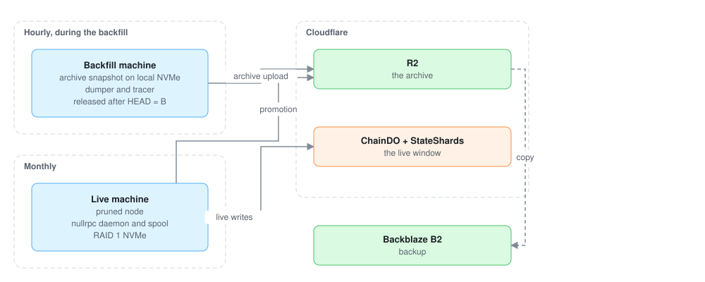

# Infrastructure

Where nullrpc runs: the object store, the machine that builds the archive, and the machine that
follows the blockchain. Sizes are Ethereum mainnet's, the benchmark.

## Object store

**R2 serves the archive.** The RPC Worker reads it through a read-only binding inside
Cloudflare's network, with no credentials and no request signing. Promotion moves `HEAD.json`
with a conditional write (`If-Match`), so two writers can never both publish. Every other object
is written create-if-absent.

**Backblaze B2 holds a backup copy.** Rebuilding the archive takes an archive snapshot and days on
a backfill machine, so every object is kept twice. The daemon copies each new object to B2 after
`HEAD.json` moves. Nothing reads B2 except a restore.

**Caching.** The Worker caches immutable frames with the Cache API, and index roots, filter blocks
and code in the isolate. Most reads of recent and popular data never reach R2.

## Backfill machine

Rented by the hour and released once the backfill is uploaded. It needs local NVMe for the archive
snapshot and the dump's working files, many cores for the witness stage, and egress to upload the
archive.

| Need | Ethereum mainnet |
|---|---|
| Archive snapshot | about 2.3 TB (Erigon) |
| Working files and output | about 1.1 TB at peak, plus witnesses |
| Local NVMe | 6–8 TB |
| Machine | Latitude.sh `rs4.metal.large`: 32 cores, 768 GB RAM, 2 × 8 TB + 2 × 480 GB NVMe, 20 TB egress a month included |

Rules:

- **Check the snapshot size** in the network's snapshot listing before renting. For a larger
  snapshot, pick a machine with local NVMe of at least the snapshot plus its working files.
- **Stream the snapshot into extraction** (`curl | zstd -d | tar -x`), so the disk holds one copy
  of it.
- **Run a test network first** with the same client, such as Hoodi for Ethereum. It exercises the
  whole pipeline in hours.
- **On-demand machines only.** The snapshot and the working files live on local NVMe for days.
- **Local NVMe only** for the node's datadir. Network-attached disks are used only as download
  targets.

## Live machine

Rented by the month on a Hetzner dedicated server. It runs the pruned node and the daemon.

| Need | Ethereum mainnet |
|---|---|
| Runs | Erigon full node with its embedded consensus client, the nullrpc daemon and its spool |
| Disk in use | about 1.5 TB (node 1.1–1.3 TB, spool and recent state layers) |
| Machine | 8–16 cores, 64–128 GB RAM, 2 × 3.84 TB NVMe in RAID 1 |

**RAID 1.** A lost node is restored from the network's newest pruned snapshot, which has no
history before it. Blocks between `P` and that snapshot could then no longer be traced. Mirrored
disks, with the spool on them, keep a single disk failure from opening that gap.

## Access and secrets

| Credential | Held by | Grants |
|---|---|---|
| R2 S3 token, archive bucket, read-write | daemon, backfill machine | object writes and `HEAD.json` |
| Cloudflare Access service token | daemon | the ingest route to `ChainDO` and `StateShard` |
| B2 application key, write-only | daemon, backfill machine | backup uploads |
| R2 binding, read-only | RPC Worker | archive reads |

The node listens for RPC on localhost only. Only its P2P ports are open to the internet.
