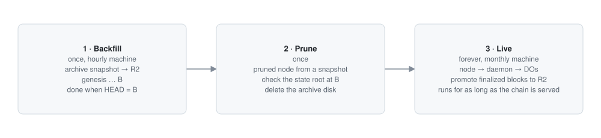
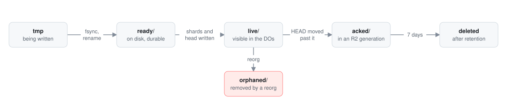

# Pipeline

How blockchain data gets from the node into R2 and the Durable Objects. Every step here is also
drawn as a dependency graph in [dags.md](dags.md). The stores themselves are specified in
[storage.md](storage.md).

The pipeline has three phases. The first two run once, and again when the archive format
changes. The third runs for as long as the blockchain is served.

| Phase | Machine | Input | Output |
|---|---|---|---|
| 1. Backfill | hourly backfill machine | the network's archive snapshot | R2 generation 1, genesis to `B` |
| 2. Prune | monthly live machine | the network's pruned snapshot | a live node past `B`, the archive deleted |
| 3. Live | monthly live machine | the live node | the live window in the Durable Objects, `P` advancing |

## Node and sources

| | Source |
|---|---|
| Backfill | the archive snapshot the network publishes for its client, read from the client's files by the dumper for that client's format |
| Live | the same client, pruned, restored from the network's pruned snapshot |

The backfill starts from a published snapshot, so it never re-executes the blockchain's history.
For Ethereum mainnet, the benchmark, the client is Erigon: the dumper reads its snapshot files
(`.seg`, `.ef`, `.v`, `.kv`), and the live node runs with `--prune.mode=full` and its embedded
consensus client.

## Phase 1: Backfill

1. **Restore the archive snapshot** on the backfill machine. Stream the download straight into
   extraction (`curl | zstd -d | tar -x`), so the disk holds one copy of the snapshot.
2. **Pick `B`**, the node's finalized block. Every later step stops at `B`, and publication
   checks that `B` is still canonical.
3. **Find block boundaries**: for each block, its range of transaction numbers in the client's
   files.
4. Three independent branches run in parallel:
   - **Block bundles**: each block's record (block, senders, receipts, blob gas price). Every
     block's receipts must hash to its header's `receiptsRoot`. From the bundles: the **hash
     index** and the **log index**.
   - **State**: every account, storage and code change from the client's history files, sorted
     into **state history** layers. The **root check** builds the state trie at `B` from the
     same data and compares its root with block `B`'s `stateRoot`; the trie is then discarded.
   - **Witnesses**: each block's pre-state from the archive node's tracer (see below). The
     **witness check** replays a sample of blocks from their witnesses and requires the same
     receipts as the archive.
5. **Upload** every object to R2 with multipart uploads. Each object's SHA-256 is checked.
6. **Write the manifest** for generation 1, then **`HEAD.json`** with a create-if-absent write.
7. **Copy everything to B2.**

The backfill is done when `HEAD.json` names a manifest that ends at `B`. Every stage writes
its output to the work directory and records completion, so a rerun resumes at the first
unfinished stage.

### Witnesses

A witness is the value, before the block, of every account, storage slot and contract code
the block touches, including keys it only reads. The RPC Worker replays any transaction of
the block from it in memory.

Produced by `debug_traceBlockByNumber` with `prestateTracer` on the archive node. The tracer
reports each transaction's pre-state; the first time a key appears in the block, its value
is the value at the start of the block. The dumper always adds what a block reads outside
its transactions: the blockchain's system contract slots (on Ethereum: EIP-4788 beacon roots,
EIP-2935 block hashes, EIP-7002 withdrawals, EIP-7251 consolidations), the withdrawal
recipients and the coinbase.

Every block's parent state is in the archive, so blocks do not depend on each other. The
witness stage runs one tracer call per core. It is the longest stage of the backfill, and it
must finish before the archive is deleted: a pruned node cannot produce witnesses for old
blocks.

## Phase 2: Prune

1. **Restore the live node** on the live machine from the network's pruned snapshot, in a new
   datadir. The prune mode is set at the first start.
2. **Set the prune distance** before the first start: at least the promotion batch plus the
   finality lag plus a day of margin ([storage.md](storage.md), "Promotion"). This margin is
   how long the daemon can be down without losing blocks.
3. **Wait until the live node is past `B+1`.**
4. **Check the state root at `B`**: the live node's header `B` must match the archive's.
5. **Start the daemon at `B+1`.** It writes the live window from `B+1` and starts promoting.
6. **When the daemon reaches the head, delete the archive** and release the backfill machine.

The live node must still hold block `B+1` and the state at `B` when the daemon starts. Start
the daemon before the node's prune window passes `B`.

## Phase 3: Live

The daemon runs the block DAG for every new block, the promotion DAG when enough
blocks are final, and the reorg DAG when the blockchain reorganizes.

### Extract

The daemon pulls from the node over local RPC:

| Data | Call |
|---|---|
| New heads | `eth_subscribe("newHeads")`, polling `eth_blockNumber` as a fallback |
| Block | `eth_getBlockByNumber(n, true)` |
| Receipts | `eth_getBlockReceipts(n)` |
| Pre-state (witness) | `debug_traceBlockByNumber(n, {tracer: "prestateTracer"})` |
| State diff | `debug_traceBlockByNumber(n, {tracer: "prestateTracer", tracerConfig: {diffMode: true}})` |
| Finality | `eth_getBlockByNumber("finalized")`, `eth_getBlockByNumber("safe")` |

The four block calls run in parallel. The tracer re-executes the block on the node, on the
parent's state, which the node keeps only within its prune distance. That distance is the
furthest the daemon can fall behind.

### Verify

Before anything is written, the daemon checks:

- the header hashes to the block hash, and its parent hash is the spooled head;
- the transactions hash to `transactionsRoot`;
- the receipts hash to `receiptsRoot`;
- the diff covers every account whose balance the block changes (senders, recipients, the
  coinbase, withdrawal recipients).

A failed check stops the daemon and raises an alert. It never writes a block it
could not verify.

### Spool

| Directory | Meaning | Next step |
|---|---|---|
| `tmp/` | being written | fsync, rename to `ready/` |
| `ready/` | durable, not yet in the Durable Objects | write shards and `ChainDO`, move the head |
| `live/` | visible in the live window | promotion |
| `acked/` | in an R2 generation that `HEAD.json` names | delete after 7 days |
| `orphaned/` | removed by a reorg | delete after 7 days |

One file per block, named `{number:020}-{hash}`. The rename is atomic, so a file in `ready/`
is always complete. On start the daemon replays `ready/` and checks that every file in
`live/` is in the Durable Objects. Every write to the Durable Objects and R2 is idempotent,
so a replay is safe.

### Write the live window

1. Write the diff to the `StateShard`s: one `applyMany` call per touched shard, all in
   parallel.
2. Write the block record and witness to `ChainDO`.
3. Move the head in `ChainDO`.

The head moves only after every row is written, so a reader never sees a block without its
state. On a blockchain with blocks faster than 2 seconds, the daemon writes groups of blocks
and the head moves per group ([storage.md](storage.md), "Parameters").

### Promote

When `F` reaches `P` plus the batch size, or the oldest unpromoted finalized block is
2 hours old, the daemon promotes blocks `P+1` to `P′` (at most `F`):

1. Read the blocks from `live/` in the spool and check every parent link. The Durable
   Objects are not read back.
2. Build, in parallel: a block bundle, hash and log index deltas, a state history layer with
   any merges it triggers, and a witness pack.
3. Upload the objects, write manifest N, and move `HEAD.json` with `If-Match` on generation
   N−1's ETag. A conflict means something else wrote `HEAD.json`: the daemon stops and alerts,
   and never overwrites.
4. Prune the shards and `ChainDO` at or below `P′`, and set `P = P′`.
5. Move the spool files to `acked/`. Copy the new objects to B2. Schedule objects that no
   manifest references any more for deletion in 7 days.

If promotion falls behind, the live window grows and keeps serving. Two limits apply: the
node's prune distance (the spool must hold every unpromoted block, and a lost spool can only
be rebuilt from the node) and the Durable Objects' storage.

### Reorgs

When a new block's parent is not the spooled head, the daemon walks back on the node to the
common ancestor `A`, fences the removed blocks in every shard, lowers the head to `A`,
truncates the shards and `ChainDO` above `A`, moves the removed blocks to `orphaned/`, and
applies the new branch block by block. Readers never see a mix of branches
([storage.md](storage.md), "Reorgs").

An ancestor below `F` means finality was violated or the node is on a wrong fork. The daemon
stops and alerts.

## Guarantees

- R2 objects are never modified. A new generation adds objects and moves `HEAD.json`.
- `HEAD.json` moves last, and only forward.
- Every block from genesis to head is in R2 or the live window, never in neither. During
  promotion it is briefly in both, and readers may use either.
- The backfill and the daemon encode blocks, state and witnesses with the same code, so
  block `B` and block `B+1` have the same format.
- The node never waits for the daemon, R2 or the Durable Objects.
- Only the daemon writes to R2 and the Durable Objects.
