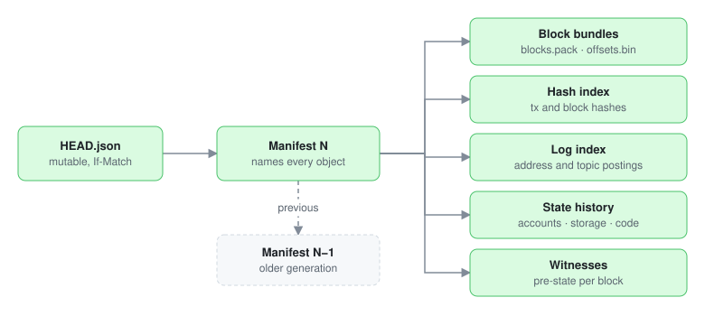
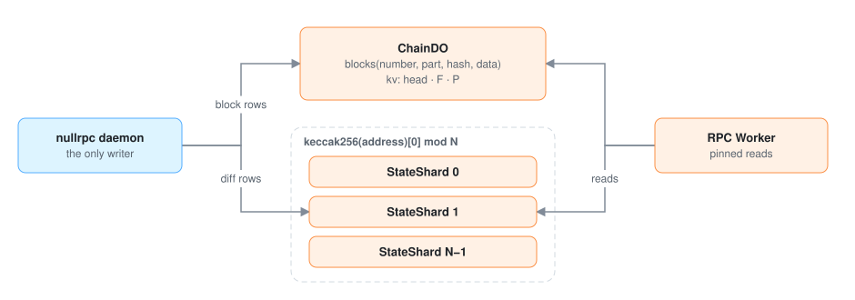
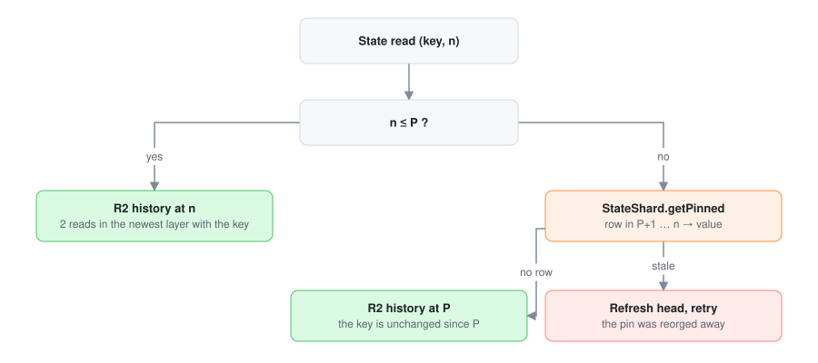

# Storage

The specification of everything nullrpc stores: the R2 archive and the two Durable Object
classes. Writers (the backfill dumper and the daemon) and the reader (the RPC Worker) both
implement this document.

| Store | Holds | Written by | Read by |
|---|---|---|---|
| R2 | genesis to `P`: immutable generations | backfill once, then the daemon's promotions | RPC Worker |
| `ChainDO`, one | `P+1` to head: block records, witnesses, head and finality pointers | daemon | RPC Worker |
| `StateShard`, `N` of them | `P+1` to head: state diffs | daemon | RPC Worker |

All integers in binary formats are little-endian unless marked otherwise. `uvarint` is
unsigned LEB128. Hashes in object keys are lowercase hex without `0x`. Block numbers in keys
are zero-padded to 20 digits. Values in backticks such as `chunk_blocks`, `N` and `batch` are
parameters, set per blockchain in "Parameters" at the end.

## R2

### Objects



```text
{chain-id}-{genesis-hash}/
  HEAD.json
  manifests/{generation:020}-{sha256}.json
  config/{sha256}.json                              # genesis allocation and fork schedule
  segments/{first:020}-{last:020}-{last-hash}/{content-id}/
    meta.json
    blocks.pack                                     # one block record per block
    offsets.bin                                     # 80 bytes per block
  hash-index/{first:020}-{last:020}/
    transactions-{sha256}.dir
    blocks-{sha256}.dir
    pack-{sha256}.pack
  log-index/{first:020}-{last:020}/
    directory-{sha256}.dir
    pack-{sha256}.pack
  state/layers/{first:020}-{last:020}-{content-id}/
    layer.json
    {domain}.{n:04}.pack                            # data pages
    {domain}.index.pack                             # index pages
    {domain}.filter                                 # blocked Bloom filter
  witnesses/{first:020}-{last:020}-{content-id}/
    offsets.bin                                     # 56 bytes per block
    witness.{n:04}.pack                             # one witness per block
```

One bucket for the archive. `content-id` is the SHA-256 of the sorted list of the directory's file
names and digests, so a directory's name changes whenever its content does.

### Rules

- **`HEAD.json` is the only object that changes.** Every other object is written with
  `If-None-Match: *` and never rewritten. Writing the same key again must produce the same
  bytes.
- **Nothing is found by listing.** A reader starts at `HEAD.json`, reads the manifest it names,
  and reaches every other object through references in the manifest.
- **Every reference is checked.** An `ObjectRef` is `{"key", "bytes", "sha256"}`. Readers check
  the size, and the SHA-256 of every frame they read.
- **A reader pins one generation per request.** It reads `HEAD.json` (cached in the isolate for
  up to 10 seconds) and uses that manifest for the whole request.
- **Garbage collection.** After a merge, objects that no manifest of the last 7 days references
  are deleted. A request never takes 7 days, so no reader loses an object it pinned.

### `HEAD.json` and the manifest

```json
{"version": 1, "generation": 42, "manifest": ObjectRef}
```

The manifest of generation N:

```json
{
  "format": "nullrpc-archive",
  "version": 1,
  "generation": 42,
  "previous": ObjectRef,
  "chain": {"id": 1, "network_id": "1", "genesis_hash": "0x…"},
  "config": ObjectRef,
  "first_block": 0,
  "archived_through": {"number": 23900000, "hash": "0x…", "state_root": "0x…"},
  "finalized_observed": {"number": 23900064, "hash": "0x…"},
  "chunk_blocks": 8192,
  "segments": [{"first": 0, "last": 8191, "last_hash": "0x…", "meta": ObjectRef}],
  "hash_index": {"key_bytes": 6, "objects": [HashIndexObject]},
  "log_index": {"key_bytes": 6, "partition_blocks": 65536, "objects": [LogIndexObject]},
  "state_history": {"layers": [{"first": 0, "last": 23899903, "level": 99, "descriptor": ObjectRef}]},
  "witnesses": {"first_block": 0, "ranges": [{"first": 0, "last": 8191, "offsets": ObjectRef, "packs": [ObjectRef]}]},
  "created_at": "2026-10-08T12:00:00Z"
}
```

- `archived_through` is `P`. Segments, state layers and witness ranges each cover every block
  from their first block to `P`, with no gaps.
- `witnesses.first_block` is the first block with a witness, normally 0.
- `config` holds the genesis allocation and the fork schedule, so the Worker knows each block's
  EVM rules without a node.

**Publication order:** data objects, then `meta.json` and `layer.json` descriptors, then the
manifest, then `HEAD.json`. The first generation writes `HEAD.json` with `If-None-Match: *`.
Every later one uses `If-Match` with the ETag of the `HEAD.json` it read. A conflict stops the
writer; it never overwrites.

### Packs

Every `.pack` file starts with a 16-byte header, followed by independent zstd frames:

| Bytes | Field |
|---|---|
| 0–7 | `NRPCPACK` |
| 8–9 | format version, `1` |
| 10–11 | codec: `1` block records, `2` state pages, `3` hash index buckets, `4` log index buckets, `5` witnesses |
| 12–15 | zero |

Each frame is one record, read with one range request. A reader checks the frame's length and
SHA-256 (from the reference that pointed to it) before decompressing, and the uncompressed
length after. The Worker refuses frames larger than 8 MiB uncompressed. Pack files rotate at
1 GiB from the backfill and 64 MiB from promotion.

### Block bundles

A segment holds consecutive blocks inside one chunk (`chunk_blocks` blocks, aligned to
multiples of it). Promotion adds segments to the open chunk; when a chunk is complete, its
segments are rewritten as one.

`offsets.bin` has one 80-byte record per block, in block order, so block N's record is at
byte `(N − first) × 80`:

| Bytes | Field |
|---|---|
| 0–31 | block hash |
| 32–39 | frame offset in `blocks.pack` (u64) |
| 40–43 | compressed length (u32) |
| 44–47 | uncompressed length (u32) |
| 48–79 | SHA-256 of the compressed frame |

Reading a block is two range reads: the 80-byte record, then the frame. The decoded block's
number and hash must match the record. The 256 hashes before a block (for `BLOCKHASH`) are one
contiguous read of `offsets.bin`.

### Block records

Each frame in `blocks.pack` is the RLP list:

```text
[raw_block, senders, receipts, blob_gas_price, extras]
  raw_block       bytes  the block exactly as debug_getRawBlock returns it
  senders         bytes  20 bytes per transaction, in order
  receipts        list   per transaction: [type, status, cumulative_gas_used, logs]
                         status: empty (failed), 0x01 (success), or a 32-byte
                         post-state root before Byzantium
                         logs: [[address, [topics…], data], …]
  blob_gas_price  uint   the block's blob base fee, 0 without blob transactions
  extras          list   per transaction: [[name, value], …], receipt fields the
                         blockchain's RPC adds that cannot be derived (empty on Ethereum)
```

`extras` keeps the format usable on a blockchain whose receipts carry extra fields. Names are the
JSON field names; values are big-endian integers.

Senders are stored so the Worker never recovers signatures. Everything else in the JSON
response is derived: block and transaction hashes, `gasUsed` from consecutive cumulative gas,
`effectiveGasPrice` from the transaction and the base fee, `contractAddress` from sender and
nonce, `logIndex` across the block, `logsBloom` from the logs, `blobGasUsed` from the blob count.

Writers check every block: the header hash, every transaction hash, and the receipts root
(receipts re-encoded in consensus form must hash to `receiptsRoot`). Before Byzantium, where
some clients keep only a status, the receipts are checked against the header's logs bloom and
gas used instead.

### Hash index

Finds the block of a transaction hash or block hash with a fixed number of reads.

An index object covers a block range and has two parts, transactions and blocks:

```json
{"first": 0, "last": 23899903,
 "transactions": {"bucket_bits": 21, "entries": 2900000000, "directory": ObjectRef},
 "blocks": {"bucket_bits": 14, "entries": 23899904, "directory": ObjectRef},
 "packs": [ObjectRef]}
```

- **Key.** `K` is the first 6 bytes of the hash, big-endian. Its top `bucket_bits` select a
  bucket. Writers choose the fewest bits that keep the average bucket at or below 2,048 entries.
- **Directory.** `2^bucket_bits` records of 56 bytes: frame offset (u64), compressed length
  (u32), uncompressed length (u32), entries (u32), pack index in `packs` (u16), zero (u16),
  SHA-256 of the frame (32 bytes). An empty bucket is 56 zero bytes.
- **Bucket frame.** Entries sorted by `(K, block, index)`. Each entry is `uvarint(K − previous
  K)`, `uvarint(block − first)` and, for transactions, `uvarint(index in block)`.

**Lookup:** for every object, one 56-byte directory read and one frame read, all objects in
parallel. Each candidate is confirmed by reading its block and comparing the full hash, so a
6-byte prefix collision never returns the wrong block.

### Log index

Finds the blocks that may contain logs matching an `eth_getLogs` filter.

- **Fields.** The emitting address (tag `0x00`) and the topic at position i (tag `0x01 + i`).
  `K` is the first 6 bytes of SHA-256(tag ‖ value).
- **Partitions.** An object's blocks are split at multiples of 65,536. A query reads only the
  partitions its range touches.
- **Directory.** Per partition, `2^bucket_bits` records in the hash index's 56-byte layout.
- **Bucket frame.** Per key, sorted by `K`: `uvarint(K − previous K)`, `uvarint(n)`,
  `uvarint(b₀ − partition start)`, then `uvarint(bᵢ − bᵢ₋₁ − 1)` for the other blocks.

**Lookup:** the filter's addresses form one group, and each constrained topic position forms
another. A group's candidates are the union of its keys' blocks; the query's candidates are the
intersection of all groups. The Worker then reads each candidate block and applies the exact
filter, so results equal a full scan.

### Index tiers

Promotion adds one hash index object and one log index object per batch. When the newest four
objects are contiguous and of the same level, they merge into one object of the next level. An
object's level follows from its span: level ℓ covers at least `batch × 4^ℓ` blocks. The
backfill's object is a base below all levels. The
index therefore has at most three objects per level, and a lookup reads every object in
parallel.

### State history

The value of every account, storage slot and code at the end of every block, stored only at
the blocks where it changed.

| Domain | Key | Value; empty means absent or zero |
|---|---|---|
| `accounts` | address, 20 bytes | `uvarint(nonce)`, `uvarint(len)`, balance (big-endian, `len` bytes), code hash (32 bytes, omitted for no code) |
| `storage` | address ‖ slot, 52 bytes | big-endian value, leading zeros removed |
| `code` | code hash, 32 bytes | bytecode; one entry, at block 0 |

A **layer** covers a block range. Per domain, its entries are sorted by `(key, block)`; an
entry `(key, block, value)` is the key's value at the end of that block.

```text
data page  := group*
group      := uvarint(len(key)) key uvarint(n) (uvarint(block_delta) uvarint(len(value)) value){n}
index page := uvarint(n) (uvarint(len(key)) key uvarint(first_block) uvarint(pack)
              uvarint(offset) uvarint(length) uvarint(uncompressed) sha256[32]){n}
```

A group's first block delta is the absolute block number, the others are relative to the previous
entry. Data pages are about 32 KiB uncompressed. An index page lists up to 1,024 data pages by
their first `(key, block)`. `layer.json` names the packs, and per domain a root with the first
`(key, block)` of every index page and the filter.

**Lookup of `(key, n)` in a layer:** pick the index page from the root (cached), read it, pick
the data page, read it, and take the key's last entry at or before `n`. Two range reads.

**Blocked Bloom filter**, one per layer and domain, every layer, no size limit:

```text
"NRPCBLM1"  u32 block_count  u32 k  (block_count × 4096 bytes)
```

A key's block is `u32(keccak256(key)[0..4]) mod block_count`. Inside that 4 KiB block it sets
k = 7 bits at `(h1 + i·h2) mod 32768`, with h1 and h2 the u64 values of `keccak256(key)[8..16]`
and `[16..24]`. Writers size `block_count` for 10 bits per key (about 1 % false positives).
Checking a key takes one 4 KiB range read per layer, and every layer's block can be read in the
same round.

**Lookup of `(key, n)` across layers:** read the filter blocks of every layer that starts at or
before `n`, in parallel. Search the layers whose filter accepts the key, newest first; the first
layer with an entry at or before `n` answers. If none does, the key was absent or zero at `n`.

**Tiers.** Promotion writes one level-0 layer per batch. When four layers of one level exist,
they merge into one layer of the next level. A level-ℓ layer covers `batch × 4^ℓ` blocks, there
is no top level, and the backfill's layer is a base below all levels. At 256 blocks per batch,
the history reaches level 9 (67 million blocks, about 25 years) with at most 3 layers per level:
a lookup reads at most about 28 filter blocks in one round and two pages after it. The daemon
runs merges one at a time between promotions; each publishes its own generation, which replaces
the merged layers and keeps every block.

### Witnesses

One frame per block in `witness.{n}.pack`. `offsets.bin` has one 56-byte record per block, in
block order:

| Bytes | Field |
|---|---|
| 0–7 | frame offset (u64) |
| 8–11 | compressed length (u32) |
| 12–15 | uncompressed length (u32) |
| 16–17 | pack number (u16) |
| 18–23 | zero |
| 24–55 | SHA-256 of the compressed frame |

```text
witness  := u8(version = 1) accounts storage
accounts := uvarint(n) (address[20] u8(flags) uvarint(nonce) uvarint(len) balance code_hash[32]?){n}
            flags: bit 0 = exists, bit 1 = has code
storage  := uvarint(n) (address[20] uvarint(m) (slot[32] uvarint(len) value){m}){n}
```

Values are the block's pre-state: what each key held when the block's first transaction to touch
it started (docs/pipeline.md, "Witnesses"). Bytecode is not repeated in the
witness: the Worker reads it from the `code` domain by hash and caches it with no expiry,
because a code hash names one immutable bytecode.

Witness ranges follow segments: one witness range per segment, rewritten with the segment
when a chunk completes.

### Reads per method

R2 range reads on a cache miss. Index roots, filter blocks, code and immutable frames are cached.

| Method | Reads |
|---|---|
| Block, header, receipts by number | 2: offset record, frame |
| Block or transaction by hash | 2 per index object in parallel, then 2 for the block |
| `eth_getLogs` | 2 per field per partition per object, in parallel; then 2 per candidate block |
| Balance, nonce, storage, code at a block | 1 round of filter blocks, then 2 pages |
| `eth_call`, `eth_estimateGas` | the state lookup above for each new key, in dependent rounds |
| Trace of a mined transaction | 2 for the witness, 2 for the block, plus uncached code |

## Durable Objects



Both classes live in the chain's `nullrpc-live-{chain-id}` Worker (`apps/live`, one Wrangler
environment per chain). The daemon writes through its ingest route
(`https://live-{chain-id}.nullrpc.dev/ingest/*`) with a bearer token (the `INGEST_TOKEN` secret).
The chain's RPC Worker, `nullrpc-rpc-{chain-id}`, reads through a service binding to its
`LiveReads` entrypoint. The daemon
writes to R2 through the S3 API with a token scoped to the archive bucket; the RPC Worker has
read-only R2 bindings.

### Rows

Both classes store one row per group of `group` consecutive blocks, keyed by the group's first
block. Groups are aligned: a group ends at a block `n` with `(n + 1) mod group = 0` (the first
group after `P` may be shorter). A row's data is one section per block:

```text
section := uvarint(number - first) hash[32] uvarint(len) payload
```

```sql
CREATE TABLE rows (first INTEGER, part INTEGER, last INTEGER, data BLOB, PRIMARY KEY (first, part));
CREATE TABLE orphans (hash TEXT PRIMARY KEY, number INTEGER, at INTEGER);  -- reorg fence, 1 hour
```

`part` is above 0 only when the data exceeds 1 MiB (SQLite rows are limited to 2 MB). A reorg into
the middle of a group rewrites the row with the blocks it keeps.

### `ChainDO`

One object, named by the chain ID. A section's payload is the block record (the same bytes as a
`blocks.pack` frame, uncompressed), its witness and its transaction hashes:

```text
payload := uvarint(len) record uvarint(len) witness uvarint(n) tx_hash[32]{n}
```

It also keeps `kv(k, v)`: head, safe, finalized, promoted (`P`), generation and the shard count.
Hash and transaction lookups use in-memory maps built from the rows on first use.

| Call | Caller | Does |
|---|---|---|
| `init(promoted, generation, shards)` | daemon | first start after the backfill |
| `putRows([{first, last, data}])` | daemon | writes rows; rewriting a group replaces it |
| `setHead(head, safe, finalized)` | daemon | moves the head; the head's section must exist, or the head is `P` |
| `fence(removed)`, `truncateAbove(n)` | daemon | reorgs |
| `pruneAtOrBelow(promoted, generation)` | daemon | after a promotion; sets `P` |
| `state()` | Worker | head, safe, finalized, `P`, generation |
| `block(number or hash, pin)` | Worker | a block's record, if at or below the pin |
| `witness(number, pin)` | Worker | a block's witness |
| `txBlock(hash, pin)` | Worker | the block of a transaction hash above `P` |

The Worker caches `state()` per data center for half a block time, and block records and
witnesses by block hash with no expiry, so most reads never reach the object.

### `StateShard`

`N` objects, named `{chain-id}-{i}`. Account `a` and all its storage live in shard
`keccak256(a)[0] mod N`. Code lives in shard `code_hash[0] mod N`. A shard's row holds only the
blocks of the group that touch it. A section's payload is the block's changes for the shard:

```text
payload := (u8(domain) key uvarint(len) value)*      domain: 1 accounts (key 20 bytes),
                                                     2 storage (52), 3 code (32), 4 wipe (20, no value)
```

On wake the object builds an in-memory index: key → versions by block.

| Call | Caller | Does |
|---|---|---|
| `applyMany([{first, last, data}])` | daemon | writes rows in one transaction |
| `fence(removed)`, `truncateAbove(n)` | daemon | reorgs |
| `pruneAtOrBelow(n)` | daemon | after a promotion |
| `getPinned(domain, key, n, pin)` | Worker | newest value at or below `min(n, pin)`; `stale` if the pin was removed |
| `scanPinned(address, n, pin)` | Worker | an account's slots changed in the window, with their newest values |

Durable Objects are billed for wall-clock time while busy and for every row written or deleted,
so `N` is small and fast chains use groups. The live window is about an hour, so each shard's
index stays a few MB.

### Ingest route

Every request carries `Authorization: Bearer INGEST_TOKEN`. Bodies are JSON; row data is base64.

| Request | Does |
|---|---|
| `GET /ingest/state` | the `ChainDO` pointers and the shard count |
| `POST /ingest/init {promoted, generation}` | first start after the backfill |
| `POST /ingest/blocks {rows: [{first, last, chain, shards: {i: data}}], head, safe, finalized}` | shard rows, then `ChainDO` rows, then the head |
| `POST /ingest/reorg {ancestor, removed}` | fence everywhere, lower the head, truncate everywhere |
| `POST /ingest/prune {promoted, generation}` | prune every shard and `ChainDO` at or below `promoted` |

### Reads above `P`



A state read at block `n`:

1. The Worker pins the head `(M, H)` from its cached `head()`.
2. If `n ≤ P`, it reads R2 state history at `n`.
3. Otherwise it calls `getPinned(key, n, (M, H))` on the key's shard. A row in `P+1 … n`
   answers. No row means the key has not changed since `P`, and the Worker reads R2 history at
   `P`.
4. `stale` means a reorg removed the pinned head. The Worker reads `head()` again and retries.

### Reorgs

The daemon runs a reorg to ancestor `A` in this order:

1. `fence(removed)` on every shard and `ChainDO`, with the hashes of every block above `A`.
   Fenced hashes are kept for one hour.
2. Lower the head in `ChainDO` to `A`.
3. `truncateAbove(A)` everywhere.
4. Apply the new branch, group by group: shards first, then `ChainDO`, then the head.

A read pinned to a removed block gets `stale` from the moment its rows can change, never a
mix of two branches.

## Promotion

A promotion starts when `F ≥ P + batch`, or when block `P+1` is finalized and older than
`max_age`. It promotes at most 8 batches at once, so a backlog clears in steps.

Each promotion writes, for blocks `P+1 … P′`: one segment and one witness range per chunk the
blocks touch, a hash index object, a log index object, a level-0 state layer built from the
blocks' diffs, the manifest and `HEAD.json`. That is tens of objects an hour.

Between promotions the daemon compacts, one step at a time, each step publishing its own
generation:

1. the newest four state layers, if they are of one level, into one layer of the next level;
2. the newest four hash index objects, then log index objects, likewise;
3. a chunk that is complete and has more than one segment: its segments into one, and its
   witness ranges into one.

Merges read the objects they replace from R2 (no egress fees). The replaced objects are deleted 7
days after the generation that dropped them; manifests are kept.

The node's `prune_distance` is one batch plus the finality lag plus a day: the daemon can be down
for a day and still pull every block it missed.

## Parameters

Set once per blockchain. The values are Ethereum mainnet's, the benchmark.

| Parameter | Ethereum mainnet | Rule for another blockchain |
|---|---|---|
| block time | 12 s | |
| `chunk_blocks` | 8,192 | about 8 GB of block records per chunk |
| `N` (state shards) | 16 | 16 for blocks of mainnet size; fewer for smaller blocks |
| `group` (blocks per row) | 1 | 1 at 2 s or slower; enough blocks for about one row per second below that; divides `batch` and `chunk_blocks` |
| `batch` | 256 blocks (51 min) | about one hour of blocks |
| `max_age` | 2 h | 2 h |
| level-0 span | `batch` | `batch` |
| `prune_distance` | ≥ 8,000 blocks | `batch` + finality lag + one day |

## Sizing

Ethereum mainnet:

| Data | R2 |
|---|---|
| Blocks, receipts, indexes, state history | 1.6–1.9 TB |
| Witnesses | 0.5–2 TB (measure on a mainnet range) |
| Total | 2.1–3.9 TB |

The Durable Objects hold only the live window: a few GB.
